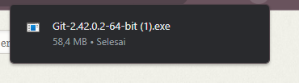
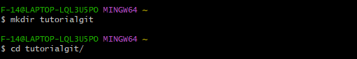

# Tutorial Penggunaan Git

Ini adalah tutorial penggunaan Git. Git adalah sistem kontrol versi yang kuat yang digunakan untuk mengelola perubahan dalam kode sumber.

## Instalasi Git

1. Unduh Git dari [https://git-scm.com/downloads](https://git-scm.com/downloads).
2. Ikuti panduan instalasi yang sesuai dengan sistem operasi Anda.

## Langkah-Langkah Dasar

1. **Inisialisasi Repositori Git**:
   - Buka terminal atau command prompt.
   - Buat direktori proyek Anda.
   - Masuk ke direktori proyek.
   - Inisialisasi repositori Git dengan perintah:
    
    $ git init

2. **Menambahkan File**:
   - Tambahkan folder atau direktori ke repositori dengan perintah:
    
    $ mkdir tutorialgit
    

3. **Membuat Commit**:
   - Buat commit untuk menyimpan perubahan dengan pesan deskriptif:
     
    $ git commit -m "Pesan commit Anda di sini"

4. **Tautkan ke Repositori Eksternal (Opsional)**:
   - Tautkan repositori lokal Anda ke repositori di layanan eksternal seperti GitHub:
    
    $ git remote add origin URL-repositori-Anda

5. **Mengirim Perubahan (Opsional)**:
   - Kirim perubahan Anda ke repositori eksternal (misalnya, GitHub) dengan perintah:
     
    $ git push -u origin master

## Catatan Tambahan

- Pastikan untuk memahami konsep dasar seperti commit, cabang (branch), dan penggabungan (merge).
- Anda juga dapat membuat file `.gitignore` untuk mengabaikan file yang tidak perlu dilacak oleh Git.

Terima kasih telah mengikuti tutorial ini. Untuk informasi lebih lanjut tentang Git, Anda dapat membaca [dokumentasi resmi Git](https://git-scm.com/doc).

Jika Anda memiliki pertanyaan atau membutuhkan bantuan lebih lanjut, jangan ragu untuk bertanya.

